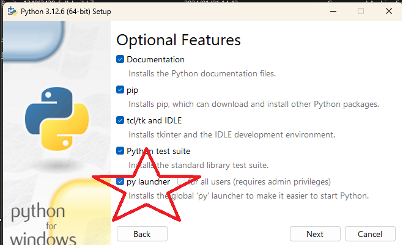

# python

環境がない人はインストール。
今回は下記前提で話を進める。

python公式のwindows installerでインストール
https://www.python.org/downloads/

for all user で環境変数通して、py launcher をインストールする。

# python 仮想環境

今回はpipenvを使用してみる。

https://pipenv.pypa.io/en/latest/

py -3.12 -m pip install pipenv

py -3.12 -m pipenv install

pipenv shell
or
py -3.12 -m pipenv shell

# 依存パッケージのインストール

https://www.sqlalchemy.org/
pipenv install SQLAlchemy

https://fastapi.tiangolo.com/ja/
pipenv install "fastapi[standard]"

